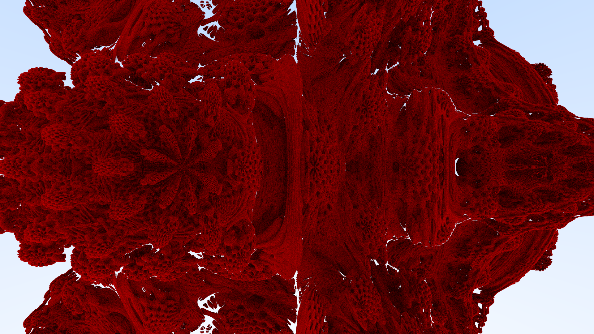

# Ray tracer in Rust

Lots of thanks to...
- [_Ray Tracing in One Weekend_](https://raytracing.github.io/books/RayTracingInOneWeekend.html)
- [Mikael Hvidtfeldt Christensen's blog](http://blog.hvidtfeldts.net/index.php/2011/06/distance-estimated-3d-fractals-part-i/)
- [Inigo Quilez's website](https://iquilezles.org/)

